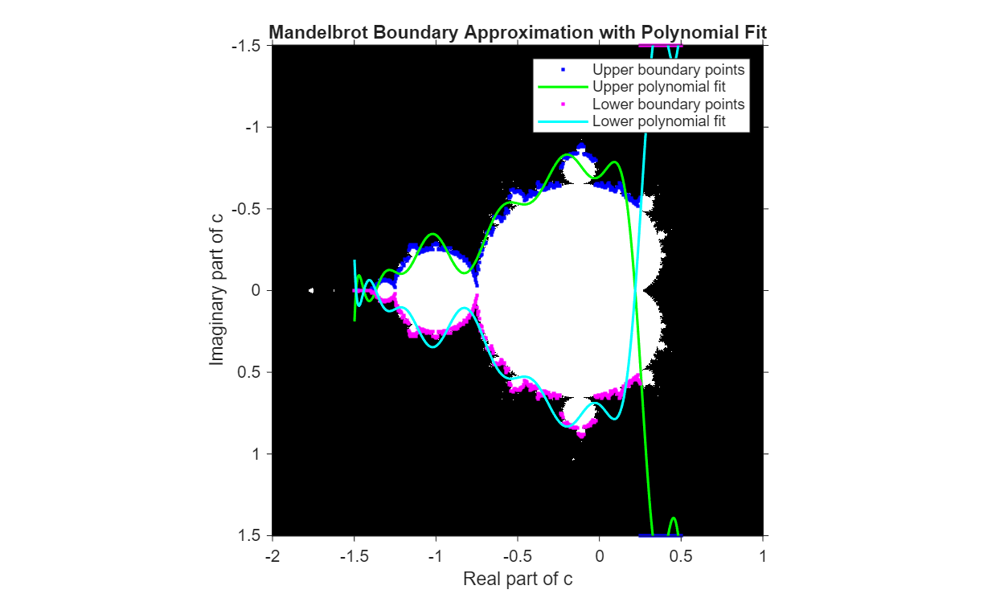

# Computing-Mandelbrot-Fractal

**Author:** Jane Condon  

---

## Introduction

In this project, we compute and plot the Mandelbrot set, which is a complex set of points for which the function  

$$
f(z) = z^2 + c
$$  

remains bounded (instead of diverging).  

We use the following steps to accomplish this:

- Implement Mandelbrot Iteration Function
- Create an Indicator Function for Boundary Detection
- Find the Boundary Using the Bisection Method
- Polynomial Approximation of the Boundary
- Plot the Mandelbrot Set and Polynomial Fit
- Calculate the Boundary Length  

---

## Implementing Mandelbrot Iteration Function

We create a function called `fractal.m` to implement the Mandelbrot iteration function.  
This function takes a complex number `c` as input and iterates  

$$
z \mapsto z^2 + c, \quad z_0 = 0
$$  

until either $|z| > 2$ or a maximum of 100 iterations is reached.  
Points that do not diverge within the maximum iterations are considered to be part of the Mandelbrot set.  

.png)  

---

## Creating an Indicator Function for Boundary Detection

We define an indicator function along a vertical line at each x-value.  
- Returns **1** for points outside the Mandelbrot set (diverges)  
- Returns **-1** for points inside (does not diverge)  

.png)  

---

## Using Bisection Method to Find the Boundary

We implement a `bisection` function to find the y-coordinate where the indicator function changes sign.  

.png)  

We apply this method along 1000 vertical lines in the interval  

$$
x \in [-2, 1]
$$  

to collect both upper and lower boundary points.  

.png)  

---

## Polynomial Approximation of the Boundary

Steps taken:  
- Select a subset of valid x-values in the main fractal region.  
- Fit a 15th-degree polynomial to the boundary points using `polyfit`.  
- Evaluate the polynomial at dense x-values to obtain a smooth curve.  

.png)  

---

## Calculating the Boundary Length

We implement the function `poly_len(p, s, e)` to calculate the curve length using:

$$
l = \int_a^b \sqrt{1 + (f'(x))^2} \, dx
$$  

.png)  

We obtain a curve length of approximately **5.9211**.  

.png)  

---

## Visual Representation

We plot the raw boundary points and the fitted polynomial curves (upper and lower bounds) overlaid on the Mandelbrot set to visualize the accuracy of the method.  

  

---

## Final Thoughts

Our estimate of the curve length is lower than expected. Possible reasons:  

- **Overfitting:** The 15th-degree polynomial may not accurately represent the boundary.  
- **Outliers:** Extreme boundary points may distort the polynomial fit.  
- **Fractal complexity:** Like the **coastline paradox**, measuring with finer resolution captures more complexity, increasing the estimated length.  

A better approach may be to:  
- Generate more boundary points.  
- Use multiple lower-degree polynomials (splines) instead of one high-degree polynomial.  

---
